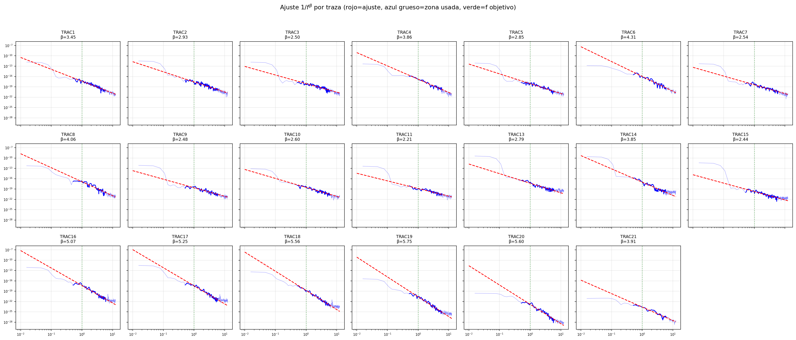
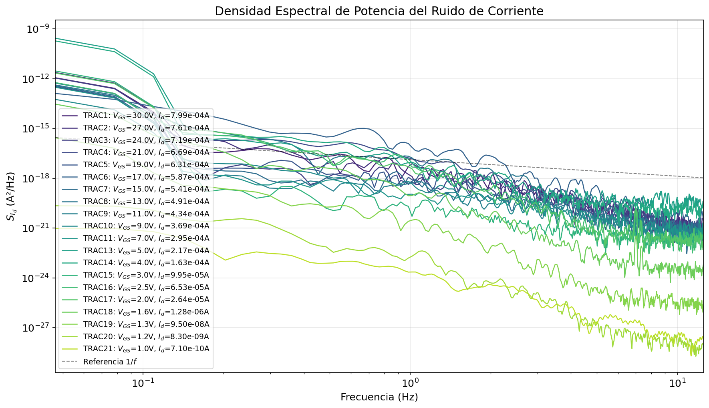
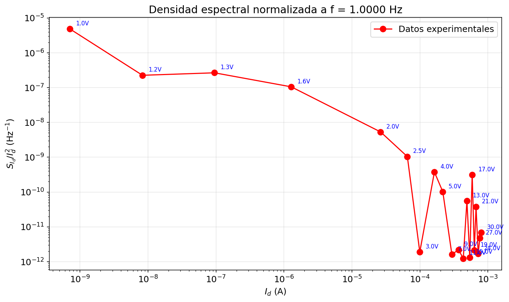
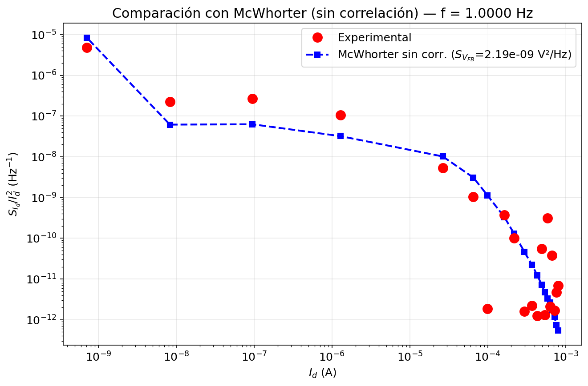
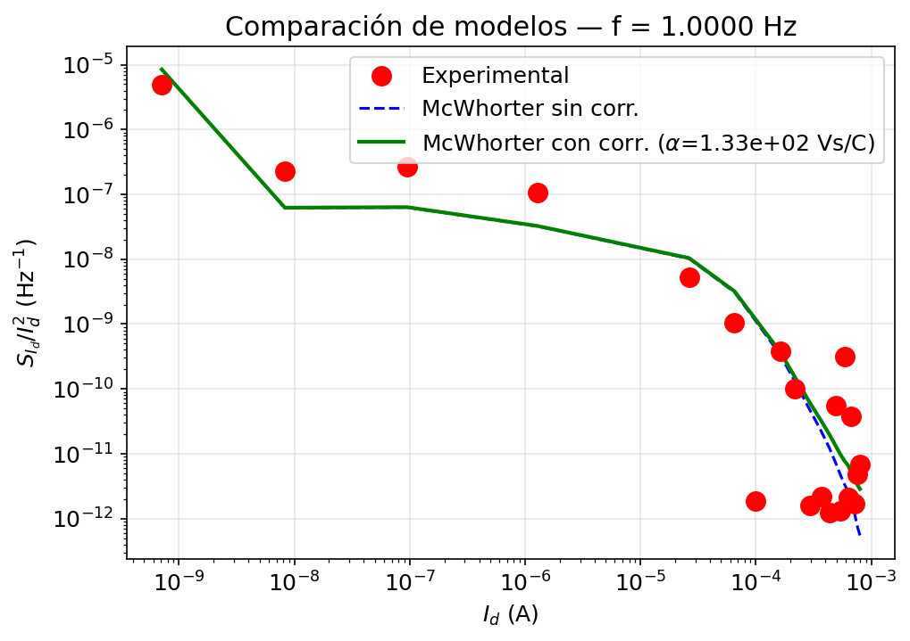
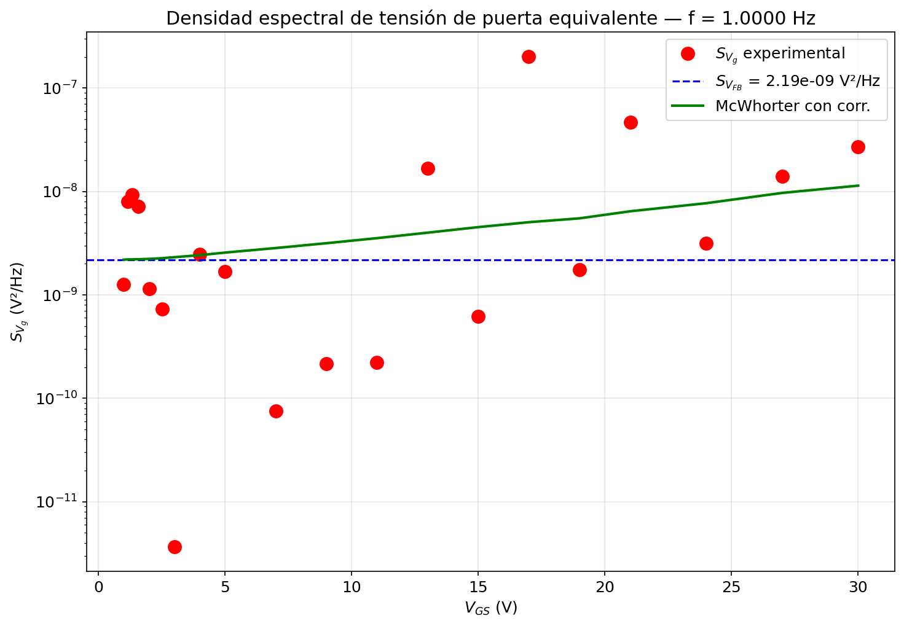

# MOSFET 1/f Noise Characterization — McWhorter Model

Experimental characterization of flicker (1/f) noise in a power MOSFET. The analysis extracts the effective oxide trap density $N_T(E_f)_\text{eff}$ at the Si-SiO₂ interface using the McWhorter model, with and without mobility correlation.

---

## Experiment Overview

The device under test is a MOSFET biased in the linear regime ($V_{DS} \approx 50$ mV). Drain current noise spectra $S_{I_d}(f)$ are measured at 21 gate bias points spanning three decades of drain current ($I_d$ from ~0.7 nA to ~0.8 mA, $V_{GS}$ from 0.987 V to 30 V).

**Measurement setup:**
- HP 35670A Dynamic Signal Analyzer (FFT, 0.015 – 12.5 Hz)
- DC suppressor to remove the quiescent drain current before the spectrum analyzer
- Transimpedance amplifier (gain $K$ V/A, set per measurement to keep signal in range)
- Conversion: $S_{I_d}(f) = S_{v_3}(f) / K^2$

---

## Physics

### 1.1 McWhorter model — no mobility correlation

Flicker noise originates from carrier number fluctuations due to tunneling exchange between inversion-layer electrons and oxide traps. The flat-band voltage noise spectral density is:

$$S_{V_{FB}}(f) = \frac{q^2 \cdot N_T(E_f)_\text{eff} \cdot kT}{W \cdot L \cdot C_{ox}^2 \cdot \gamma \cdot f}$$

The normalized drain current noise is:

$$\frac{S_{I_d}}{I_d^2} = \left(\frac{g_m}{I_d}\right)^2 S_{V_{FB}}$$

### 1.2 McWhorter model — with mobility correlation

When correlated mobility fluctuations are included, the model becomes:

$$\frac{S_{I_d}}{I_d^2} = \left(1 \pm \alpha \mu_\text{eff} C_{ox} \frac{I_d}{g_m}\right)^2 \left(\frac{g_m}{I_d}\right)^2 S_{V_{FB}}$$

where $\alpha \sim 10^4$ Vs/C is the mobility-fluctuation correlation parameter.

### 1.3 Extraction of oxide trap density

$$N_T(E_f)_\text{eff} = \frac{S_{V_{FB}} \cdot f \cdot W \cdot L \cdot C_{ox}^2 \cdot \gamma}{q^2 \cdot kT}$$

**Device parameters:**

| Parameter | Value |
|-----------|-------|
| $\mu$ | 1500 cm²/Vs |
| $t_{ox}$ | 34 nm |
| $C_{ox}$ | 1.016×10¹ F/cm² |
| $W \times L$ | 84 µm × 1 µm |
| $\gamma$ | 10¹⁰ m⁻¹ |

---

## Repository Structure

```
.
├── data/               # Raw measurement files from HP 35670A (TRAC*.TXT, .HDR, .X, .Z)
├── figures/            # Figures generated by the notebook
├── notebooks/
│   └── Analisis_Ruido_MOSFET.ipynb   # Main analysis notebook
├── .gitignore
├── .gitattributes
└── README.md
```

---

## Results

### Transfer Curve $I_{DS}$–$V_{GS}$ and Transconductance



Linear and log-scale drain current vs gate voltage, and transconductance $g_m$ computed by finite differences.

### Noise Spectra $S_{I_d}(f)$



Power spectral density of drain current fluctuations for all 20 bias points. Clear 1/f slope is visible across the low-frequency range.

### 1/f Spectral Fits per Trace


Individual log-log fits of $S_{I_d}(f) \propto f^{-\beta}$ per trace. The exponent $\beta$ is extracted to confirm 1/f behavior and to interpolate the spectrum to $f = 1$ Hz.

### Normalized Noise $S_{I_d}/I_d^2$ vs $I_d$



Normalized drain current noise at $f = 1$ Hz as a function of drain current.

### McWhorter Model — No Mobility Correlation



Best-fit flat-band voltage noise $S_{V_{FB}}$ extracted by least-squares minimization in log space.

### McWhorter Model — With Mobility Correlation



Both models overlaid. The correlation parameter $\alpha$ is fitted with $S_{V_{FB}}$ fixed from the previous step.

### Gate-Referred Voltage Noise $S_{V_g}$ vs $V_{GS}$



Equivalent input-referred noise voltage. Without correlation, $S_{V_g} \approx S_{V_{FB}}$ = const; with correlation, a parabolic dependence on $V_{GS}$ appears.

---

## Requirements

```
numpy
matplotlib
scipy
pandas
openpyxl
```

Install with:
```bash
pip install numpy matplotlib scipy pandas openpyxl
```

---

## Usage

```bash
jupyter notebook notebooks/Analisis_Ruido_MOSFET.ipynb
```

The notebook reads data from `../data/` (relative to the notebook) and saves all figures to `../figures/`.
